# Procesverslag
Markdown is een simpele manier om HTML te schrijven.  
Markdown cheat cheet: [Hulp bij het schrijven van Markdown](https://github.com/adam-p/markdown-here/wiki/Markdown-Cheatsheet).

Nb. De standaardstructuur en de spartaanse opmaak van de README.md zijn helemaal prima. Het gaat om de inhoud van je procesverslag. Besteedt de tijd voor pracht en praal aan je website.

Nb. Door *open* toe te voegen aan een *details* element kun je deze standaard open zetten. Fijn om dat steeds voor de relevante stuk(ken) te doen.

## Jij

  
Uitwerken voor kick-off werkgroep

  ### Auteur:
  Elles Epskamp

  #### Je startniveau:
  Rood

  #### Je focus:
  Helemaal responsive
 

## Je website

  
Uitwerken voor kick-off werkgroep

  ### Je opdracht:
  https://www.starbucksathome.com/nl/

  #### Screenshot(s) van de eerste pagina (small screen): 
  Recepten 
  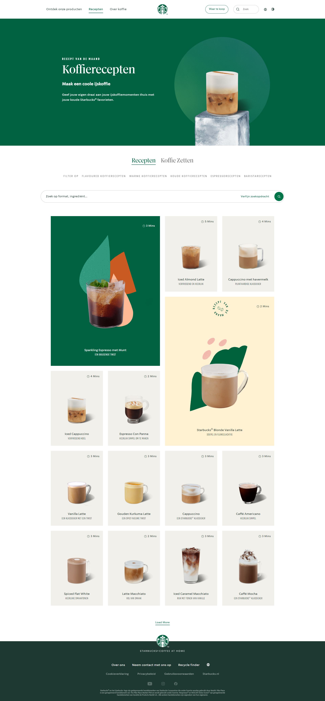

  #### Screenshot(s) van de tweede pagina (small screen):
  Over koffie 
  
 

## Toegankelijkheidstest 1/2 (week 1)

  
Uitwerken na test in 2e werkgroep

  ### Bevindingen Screenreader
  Als je de voiceover functie op je macbook gebruikt loop je tegen een aantal dingen aan. Zo merk je meteen dat je heel wat uitleg nodig hebt om uberhaupt te weten hoe je de voiceover moet gebruiken. Er zijn namelijk heel veel opties binnen het gebruiken van voiceover. De toetsen zijn moeilijk om met je handen eenvoudig bij te kunnen komen. Het vereist dus best wel wat training om de screenreader onder controle te kunnen krijgen. Ik heb er thuis na de les nog even voor gezeten om het echt te kunnen begrijpen, want je hebt echt je koppie erbij nodig. Ook raad ik echt aan om de screenreader in je eigentaal te zetten als je ook websites in die taal gebruikt want anders wordt het nog gecompliceerder.

  Ik heb uiteindelijk met de screenreader de starbucksathome receptenpagina en overkoffie doorlopen met de screenreader. Hierbij vielen een aantal dingen op. Allereerst werden er heel veel linkjes gebruikt, waardoor je niet echt snel door de website heen kon navigeren. Vooral de filteropties van wat soort koffie je zou willen maken duurde lang om doorheen te komen, omdat alle opties werden benoemd. Verder viel me op dat de afbeeldingen erg matige alternatieve teksten hebben, je kan er niet heel veel uithalen bij de meeste afbeeldingen. Na het doorlopen van de site met de voiceover heb ik gebruik gemaakt van de rotor om de headings en de linkjes op de website te doorlopen, daar heb ik de volgende bevindingen uit verkregen.

  Bij het doorlopen van de headings viel me op dat het er veel minder waren dan dat ik zelf zou gebruiken, het is nu moeilijk om de structuur van de site te snappen en per section door de site heen te lopen. Ook hadden sommige headings niet echt specifieke namen, dus wist je niet altijd even goed wat je kon verwachten. Op de over koffie pagina was maar 1 heading te vinden, dus die pagina is helemaal lastig om met een screenreader doorheen te komen.

  Ook bij het doorlopen van linkjes op de website zijn me een aantal dingen opgevallen. De site bevat erg veel linkjes, als je daar allemaal doorheen moet ben je echt wel even bezig. De linkjes van de site werken daarnaast ook niet helemaal lekker, want sommige zijn zo algemeen verwoord dat je echt niet weet wat je kan verwachten als je naar het linkje heen navigeert. Denk bijvoorbeeld aan socials → welke social hebben ze het over of lees meer → waar is meer over te lezen

  Samenvattend, deze site kan nog veel verbeteringen gebruiken voor de gebruikers van een screenreader, zodat deze makkelijker door de site heen kunnen navigeren en hun doel kunnen bereiken.

  ### Bevindingen WCAG checklist
  Naast het gebruiken van een screenreader hebben we ook een WCAG checklist doorlopen om te kijken hoe toegankelijk de website is die we gaan gebruiken voor de opdracht. Hier zijn ook een aantal bevindingen uit gehaald.

  Op zich zou je kunnen zeggen dat de website redelijk voldeed aan de WCAG checklist, maar er is zeker ook nog veel ruimte voor verbetering, terwijl ik dat van te voren niet echt had bedacht. Soms zijn categorien bijvoorbeeld onduidelijk geformuleerd of gaat het niet goed met het child element ten opzichte van de parent. Ook heb ik gemerkt dat de site soms niet helemaal lekker navigeert als je er met het keyboard door heen gaat, de volgorde van het navigeren is soms erg onlogisch. De site werkt wel erg goed op mobiel, schaalt bijvoorbeeld goed mee. Een groot winstpuntje zou zijn om meer headings te gebruiken en geen heading levels te skippen, want nu had je op een pagina bijvoorbeeld alleen een h1 of alleen een h1 en dan vervolgens een h3. Het gaat ook nog niet altijd even lekker met de alternatieve teksten onder afbeeldingen, of ze zeggen niet veel nuttigs over de getoonde afbeelding of er zijn decoratieve afbeeldingen die wel alt-tekst bevatten terwijl dit overbodig is. Vooral de controls kunnen nog aandacht gebruiken, zo zijn er niet altijd states zichtbaar van bijvoorbeeld knoppen of kan je geen onderdelen overslaan, het is ook niet altijd even duidelijk wanneer er een nieuw venster zal openen als er op een bepaalde link wordt geklikt. De site ondersteund geen dark mode en de blokken om de verschillende recepten vallen weg als je de site bekijkt in grijstinten, dit is erg onhandig als je een bepaald recept beter wilt bekijken. Het kleurcontrast van de site zit wel goed. 

  Kortom de site heeft zeker een aantal sterke punten, maar er is ook nog ruimte voor verbetering die ik zou kunnen gebruiken als ik de site ga namaken.
  

## Breakdownschets (week 1)

  
Uitwerken na afloop 3e werkgroep

  ### De hele pagina - recepten: 
  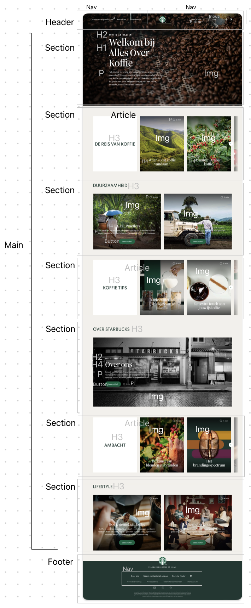

  ### Dynamisch deel: 
  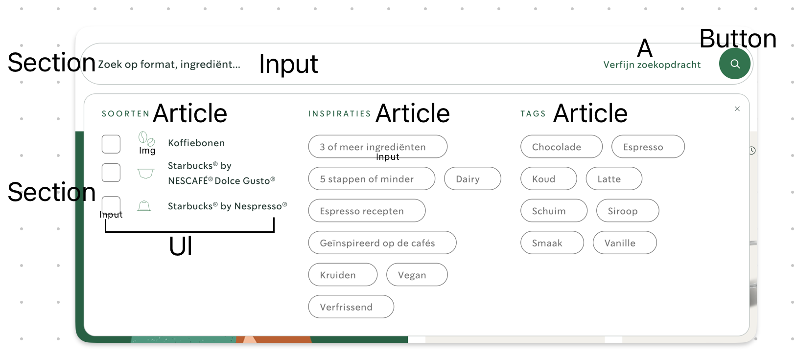

  ### De hele pagina - over koffie: 
  

  ### Dynamisch deel: 
  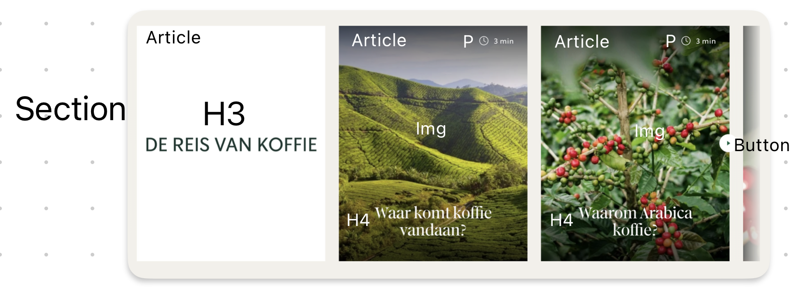

## Voortgang 1 (week 2)

  
Uitwerken voor 1e voortgang

  ### Stand van zaken
  Het opzetten van de html ging best soepel en stond ook best wel snel. Bij het werken aan de css ontstonden hier en daar wel wat moeilijkheden. Zo vond ik het lastig om te werken zonder classes, omdat ik nu erg vast liep met het feit dat je twee html pagina's hebt en toch apart elementen wil aanroepen zonder dat deze elementen voor beide pagina's wordt aangepast. Ook vond ik het lastig om de background voor de intro van de receptenpagina lekker uitgelijnd te krijgen. Ik wil de tekst namelijk graag links hebben en de afbeelding rechts maar dat gaat niet zo makkelijk als ik had gehoopt. Ook kreeg ik het logo niet lekker in het midden van mijn header, terwijl alle margins en paddings naar mijn idee wel goed stonden.

  Uiteindelijk heb ik de tekst links uitgelijnd gekregen en de afbeelding naar rechts, maar het logo in het midden van de pagina is nog niet helemaal lekker gelukt. Ook heb ik bij de intro van mijn receptenpagina het probleem dat het vlak met de elementen niet helemaal lekker meeschaald naar kleiner formaat. En weet ik niet helemaal hoe ik mijn koffie's het beste kan gaan kaderen naast natuurlijk het gebruiken van een grid.

  ### Screenshots voor de ondersteuning
  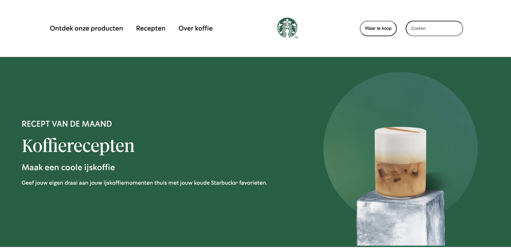
  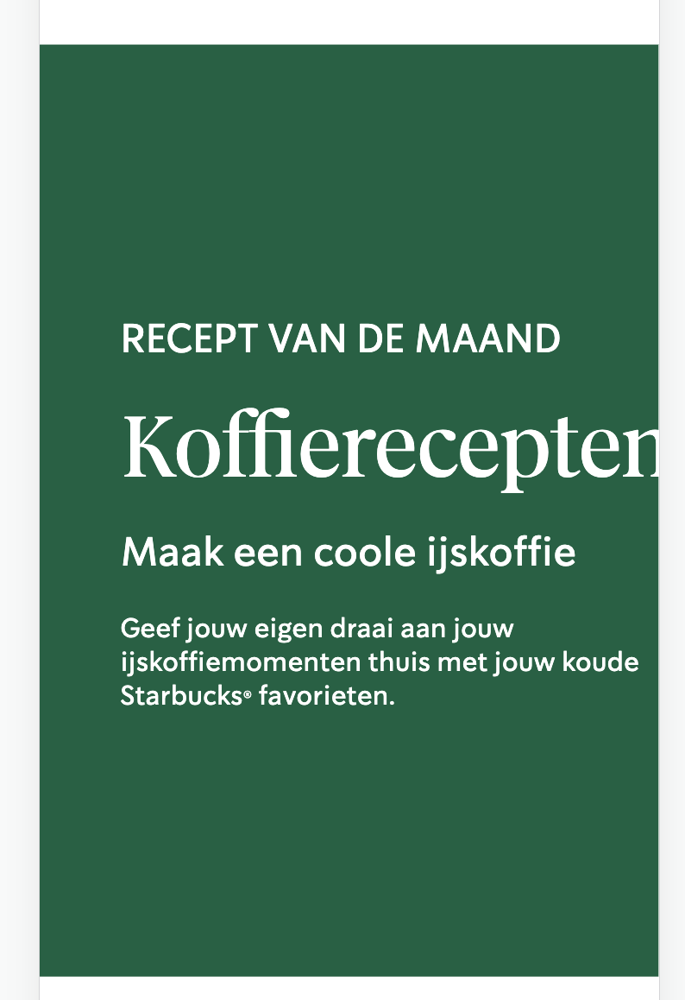
  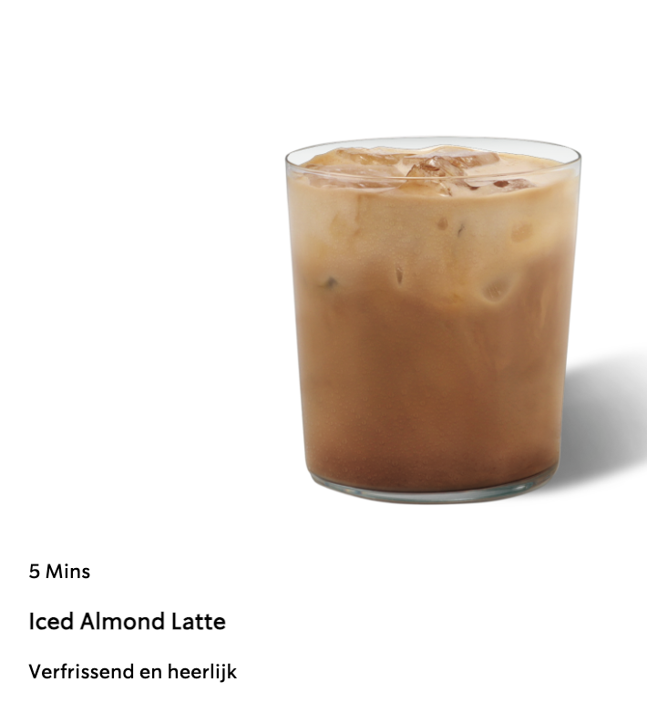
  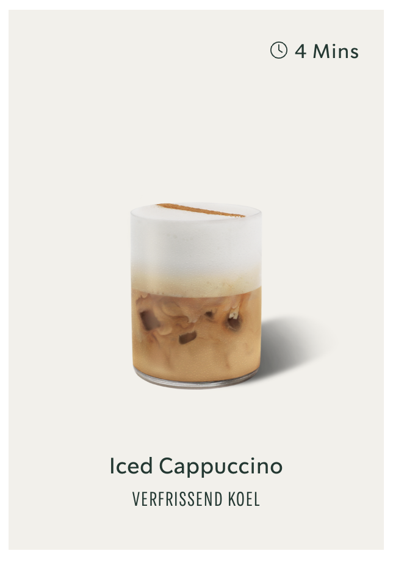

  ### Agenda voor meeting 14 september
  Groepje B2

  | S1 Amber                | S2 Rhania                   | S3 Sophie                    | S4 Elles
  | ---                     | ---                         | ---                          | ---              
  | - Het schalen van tekst | - Het gebruiken van flexbox | - Het gebruiken van flexbox  | - Het plaatsen van het logo in het midden van de pagina
  | - Selectoren css        |                             |                              | - Het meeschalen van de intro naar kleiner formaat
  |                         |                             |                              | - Kaderen van de koffie's in een grid

  Samenvattend
  - Schalen naar kleiner formaat tekst en tekst+afbeelding
  - Flexbox
  - Uitlijnen met flexbox
  - Responsive
  - Css selectors
  - Elementen samenzetten in een vakje van een grid

  ### Verslag van meeting

  - Goed de sections, articles gebruikt
  - Html ziet er strak uit
  - Section: gebruiken voor een groep, article: iets eruit halen
  - Gebruik van figures is niet echt nodig
  - Zet de header eventueel in een grid

## Voortgang 2 (week 3)

  
Uitwerken voor 2e voortgang

  ### Stand van zaken
  Het afmaken van de eerste pagina met css ging erg goed na de werkgroep, heb in het weekend veel gedaan kunnen krijgen waardoor ik de eerste pagina zo goed als af heb kunnen krijgen, dus daar ben ik erg blij mee. Wel was het werken aan de tweede pagina best lastig af en toe. Het maken van de sliders ging bijvoorbeeld niet in een keer helemaal goed, doordat de h3 die hierbij hoorde niet deed wat ik wilde doen. Ik had op de tweede pagina wel vaker problemen met de plaatsing van de h3 en hoop door dit voortgangsgesprek dit eenvoudiger te kunnen oplossen. De tweede pagina is nu voor 1/3 af en hoop hem dit weekend met behulp van deze voortgang op de javascript na af te hebben.

  ### Screenshots voor de ondersteuning
  
  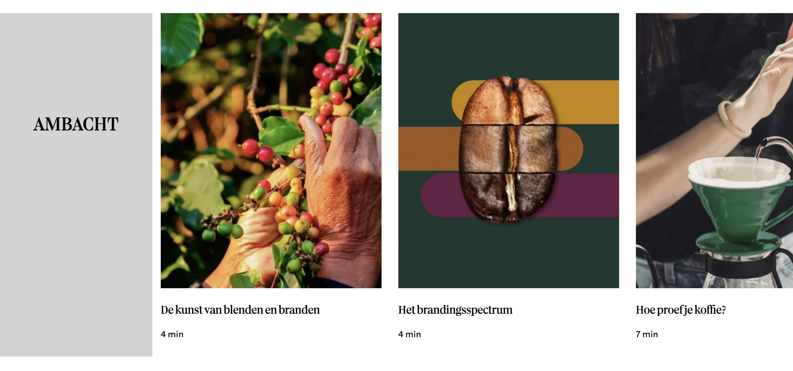
  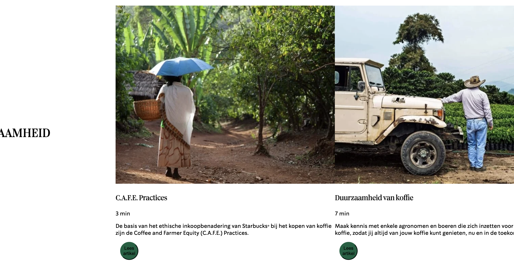

  ### Agenda voor meeting 21 september
  Groepje B2

  | S1 Amber                              | S2 Rhania                   | S3 Sophie                    | S4 Elles
  | ---                                   | ---                         | ---                          | ---              
  | - Knoppen centreren en goede positie  | - Uitklapmenu               | - Uitklapmenu gehele pagina  | - Grid van twee blokken met heading erboven
  | - Gebruik sections/article            | - Website responsive        |                              | - Linkjes href #
  | - Carrousel vereenvoudigen            |                             |                              | - Schalen klein scherm
  |                                       |                             |                              | - Uitlijning section 2,6 -> specifiek
  |                                       |                             |                              | - Css reset page 2 mogelijk? 

  Samenvattend
  - Grid van twee blokken en heading erboven
  - Linkjes href
  - Schalen klein scherm, website responsive
  - Uitklapmenu
  - Positionering knoppen
  - Gebruik sections/articles
  - Eenvoudige carrousel

  ### Verslag van meeting
  - em voor tekst, plaatje %
  - flex: wrap als ze op mobiel onder elkaar moeten
  - geen thematische groepering → div
  - Section: groep thematische content, styling mag je div gebruiken
  - Kijk echt waar sections echt relevant zijn
  - Bijsnijden: overflow hidden misschien bij 2e pagina header
  - Linkjes allemaal naar de andere pagina linken
  - Of een button of een link, nooit allebei, stijl desnoods a als een button
  - Styling met divs voor bijvoorbeeld twee elementen naast elkaar -> geen sections dus

## Toegankelijkheidstest 2/2 (week 4)

  
Uitwerken na test in 9e werkgroep

  ### Bevindingen
  Lijst met je bevindingen die in de test naar voren kwamen (geef ook aan wat er verbeterd is):
  -  Mijn HTML kwam wel door de validator heen in tegen stelling tot de originele website
  - Doordat mijn site nog niet helemaal responsive is werkt viewport zoom nog niet lekker en werkt hij nog niet lekker voor mobiel, hier wilde ik nog mee aan de slag gaan door aan de slag te gaan met het weghalen van de margins en max en min width met behulp van media queries.
  - Mijn website werkt lekker met keyboard en heeft ook een visuele focus die past bij het ontwerp van de website.
  - De site was goed te doorlopen met een screenreader alleen mochten sommigen labels voor bijvoorbeeld knoppen nog wat specifieker en was elke link bezocht, dus ook dat wil ik nog fixen door ze een specifiekere naam te geven.
  - Er worden heading elementen gebruikt om content te introduceren.
  - Er worden geen heading levels overgeslagen.
  - Er worden juiste benamingen gebruikt voor de verschillende controls.
  - Controls bevatten nu focus states
  - De site bevat helaas geen ondersteuning voor dark/light mide, high-contrast mode en increase text size, omdat de focus op responsive lag en daar niet heel veel tijd voor was.
  - Color contrast van de site zit goed in elkaar.

## Voortgang 3 (week 4)

  
uitwerken voor 3e voortgang

  ### Stand van zaken
  hier dit ging goed & dit was lastig (neem ook screenshots op van delen van je website en code)

  ### Agenda voor meeting
  samen met je groepje opstellen

  Student 1 Amber
  - Waar kan ik px gebruiken en waar em voor gebruiken?
  - Hoe voeg je captions en transcript toe?

  Student 2 Rhania
  - Menu transitie scherm inkomen

  Student 3 Sophie
  - Menu transitie scherm inkomen
  
  Student 4 Elles
  - Responsive maken met betrekking tot margins
  - Werken met mediaqueries, voor de diverse schermformaten
  - Sections juist gebruikt, of meer divjes
  - Articles juist toegepast

  Samenvattend
  - Px vs em
  - Captions en transcript
  - Responsive margins
  - Mediaqueries
  - Sections vs divjes
  - Articles gebruik

  ### Verslag van meeting
  - Margins kan je gewoon gebruiken om responsive te maken
  - Media queries kan je gebruiken op het moment dat de site stuk gaat, verder voor het responsive maken gebruiken
  - Toepassing sections en articles terug te vinden in foto teamskanaal
  - Volgende keer mobile first beginnen, is net iets makkelijker
  - Volgende stap: responsive maken en regels javascript toevoegen

## Eindgesprek (week 5)

  
Uitwerken voor eindgesprek

  ### Mijn uitkomst
  ### Receptenpagina
  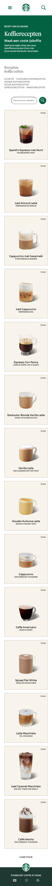
  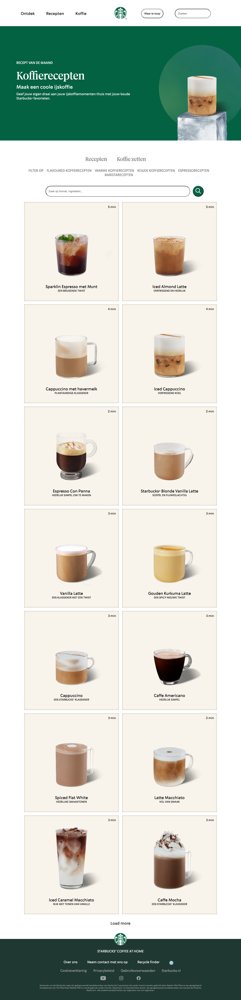
  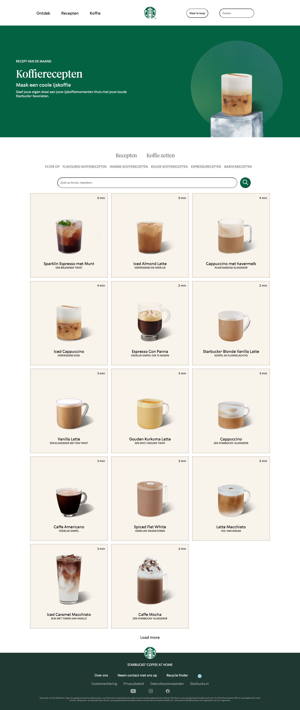

  ### Koffiepagina
  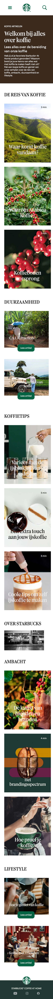
  
  

  ### Dit ging goed/Heb ik geleerd: 
  Ik heb gedurende dit vak heel veel meer geleerd van wat je met css kan, zoals bijvoorbeeld het maken van een hamburgermenu, het gebruiken van een grid, het plaatsen van tekst over afbeeldingen heen maar ook hoe je elementen kunt positioneren. Door wat struggles met postion:absolute en beginnen met laptopformaat heb geleerd om altijd mobile-first te werken en zo min mogelijk postion:absolute te gebruiken om zo extra werk te voorkomen. Wat me het meest is bijgebleven is de manier van het aanspreken van elementen, waar ik voorheen altijd classes gebruikte ben ik er nu achter gekomen dat het anders kan. Hetzelfde geldt voor het aanmaken van variabelen voor de diversen kleuren.

  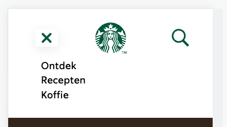
  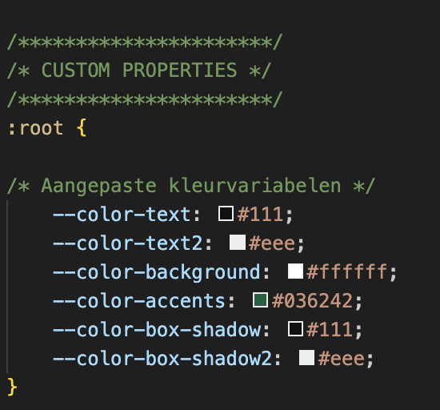

  ### Dit was lastig/Is niet gelukt:
  Ik had gedurende dit vak erg veel moeite met de tweede pagina, dit omdat deze in zijn geheel bestond uit afbeeldingen met daaroverheen tekst en ik veelal position:absolute hiervoor had gebruikt. Vooral op het moment dat ik het scherm wilde gaan schalen werkte dit niet lekker mee. Mede ook omdat ik niet mobilefirst ben begonnen. Uiteindelijk heb ik het wel kunnen fixen bij de meeste afbeeldingen met behulp van mediaqueries. Alleen op heel klein formaat ziet dit er nog niet heel lekker uit en bij het stukje over starbucks heb ik het helaas niet voor elkaar gekregen.

  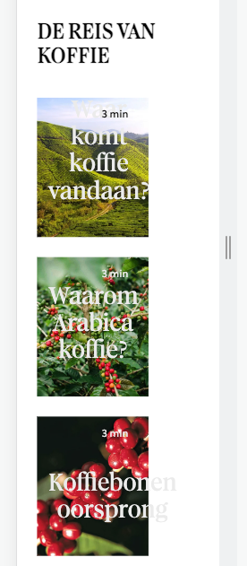
  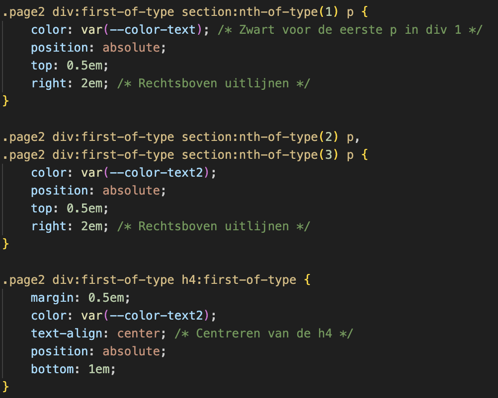

## Bronnenlijst

  
Continu bijhouden terwijl je werkt

  - W3schools.com. (2023). *CSS background-image property*. [online] Available at: https://www.w3schools.com/cssref/pr_background-image.php [Accessed 12 Sep. 2023].
  - Imagecolorpicker.com. (2022). *👍 Color Picker online | HEX Color Picker | HTML Color Picker*. [online] Available at: https://imagecolorpicker.com/en [Accessed 12 Sep. 2023].
  - Fontke.com. (2020). Lander Grande Font Download,Lander Grande Regular Font Download,LanderGrande-Regular Font Download|Lander Grande Regular 1.000;Lander Font Download-OTF Font/Uncategorized Font-Fontke.com For Mobile. [online] Available at: https://eng.m.fontke.com/font/162053989/download/ [Accessed 12 Sep. 2023].
  - BestFonts.pro. (2022). *Font SoDo Sans: download and install for free.* [online] Available at: https://en.bestfonts.pro/font/download/6328c84e6c15c1f2b8168fb6 [Accessed 12 Sep. 2023].
  - https://www.facebook.com/flaticon (2020). *Search Icon - 3031293*. [online] Flaticon. Available at: https://www.flaticon.com/free-icon/search_3031293?k=1694865872212&log-in=google [Accessed 16 Sep. 2023].
  - W3schools.com. (2023). *CSS Layout - The position Property*. [online] Available at: https://www.w3schools.com/css/css_positioning.asp [Accessed 16 Sep. 2023].
  - [Css-tricks.com](http://css-tricks.com/). (2023). Available at: https://css-tricks.com/wp-content/uploads/2022/02/css-flexbox-poster.png [Accessed 19 Sep. 2023].
  - Mozilla.org. (2023). *@font-face - CSS: Cascading Style Sheets | MDN*. [online] Available at: https://developer.mozilla.org/en-US/docs/Web/CSS/@font-face [Accessed 24 Sep. 2023].
  - Mozilla.org. (2023). *scale() - CSS: Cascading Style Sheets | MDN*. [online] Available at: https://developer.mozilla.org/en-US/docs/Web/CSS/transform-function/scale [Accessed 27 Sep. 2023].
  - Fontawesomeicons.com. (2023). *ionicons-v5-j*. [online] Available at: https://fontawesomeicons.com/svg/icons/menu-hamburger [Accessed 1 Oct. 2023].
  - Icons8 (2023). *Google Web Search*. [online] Icons8.com. Available at: https://icons8.com/icons/set/search-button [Accessed 1 Oct. 2023].
  - CodePen. (2023). *FED 23/24 - JS 3-stap - Oefening 2 - responsive 2-buttons hamburger - uitwerking*. [online] Available at: https://codepen.io/shooft/live/MWZYoqa [Accessed 4 Oct. 2023].
  - Icons8.com. (2023). *Download 1,316,800 free icons (SVG, PNG)*. [online] Available at: https://icons8.com/icons [Accessed 4 Oct. 2023].

